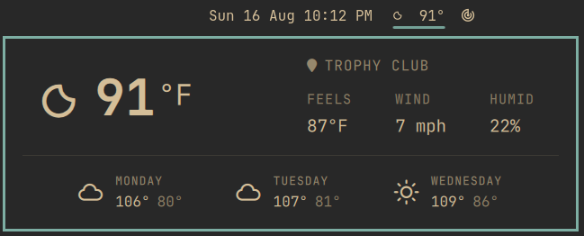

# Tempest

Weather for the [Omarchy](https://omarchy.org) bar, with the current temperature
next to the condition icon.

Owned by [ol4vr](https://github.com/ol4vr) for Omarchy+. Based on Omarchy's
built-in weather widget and forked from
[unleashed-nick/omarchy-tempest](https://github.com/unleashed-nick/omarchy-tempest).
The forecast popup, location picker, and data sources are unchanged; the bar
pill shows **icon + temp** instead of the icon alone.



## Install

```bash
omarchy plugin add https://github.com/ol4vr/omarchy-plus-tempest.git --enable
omarchy plugin disable omarchy.weather
```

Disable stock weather or you will have two weather pills. The widget lands in
the center of the bar. Move it if you want:

```bash
omarchy bar move io.github.ol4vr.tempest --section center --after omarchy.clock
```

### Updating

```bash
omarchy plugin update io.github.ol4vr.tempest
omarchy restart shell
```

### Removing it

```bash
omarchy plugin remove io.github.ol4vr.tempest
omarchy plugin enable omarchy.weather
```

That deletes Tempest and its bar entry. It leaves
`~/.local/state/omarchy/settings/weather.json` alone, since that file is owned
by `omarchy-weather-location` and is shared with stock weather.

### Requirements

Omarchy Quattro, and `curl`, which Omarchy already installs. The plugin calls
`omarchy-weather-location`, `omarchy-weather-status`, and
`omarchy-notification-send` — all ship with Omarchy. Nothing else is installed.

## Usage

| | |
| --- | --- |
| Left click | open the forecast popup |
| Right click | send a full weather notification |
| Middle click | refresh |
| Click the location in the popup | search and set a city |

Temperature units follow locale and country (Fahrenheit in the US, Celsius
elsewhere).

## License

MIT. The forecast panel is derived from Omarchy's `omarchy.weather` plugin.
See [LICENSE](LICENSE).
